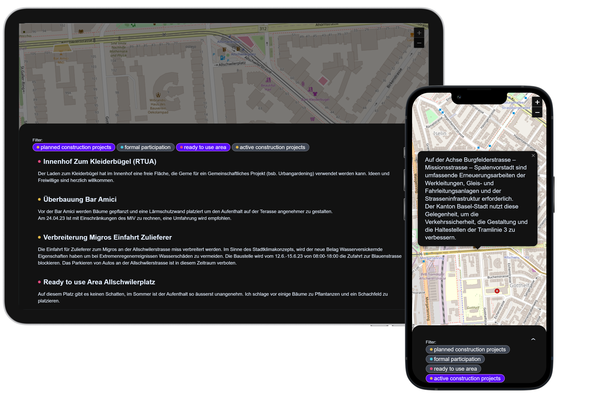

# DINA Map (Basel West)
**DINA Map** is a successfull challenge of the hackathon [Hack4SocialGood](https://www.bfh.ch/de/aktuell/fachveranstaltungen/hack4socialgood/) held in Bern, Switzerland.

> See the back-end repository: [dina-map-api](https://github.com/adrha/dina-map-api)

## THE CHALLENGE
As part of a construction project aimed at redesigning the streets in Basel West, the potential should be leveraged to collectively design and utilize public spaces.  
By utilizing new communication tools (electronic) and organizing meetings (analog), a network among local stakeholders (businesses, institutions, residents) should be established.  
This network will address issues related to the public space and work towards a positive transformation that enhances the pedestrian experience along the 1.5 km stretch.  

In addition, citizens and local businesses should receive a platform that informs them about ongoing and planned construction projects by the building authority, enabling them to provide input or participate in shaping the development of the area when called upon to participate.

  
 

## THE SOLUTION
  

The **DINA - Digital Interactive Neighborhood App with Map** is a web application designed to keep citizens and local businesses informed about urban development projects, while also providing them with opportunities to participate in various construction projects.  
It provides information about so called "ready to use areas" to strengthen the awareness of benefits and funding options related to creating a climate resilient neighbourhood.

  
 

## THE TECHNOLOGY  

**Frontend:**
- React
- Tailwind CSS
- Leaflet

**Backend:**
- .NET 6 (REST API)
- MariaDB
- Docker

## FURTHER STEPS
tbd :)